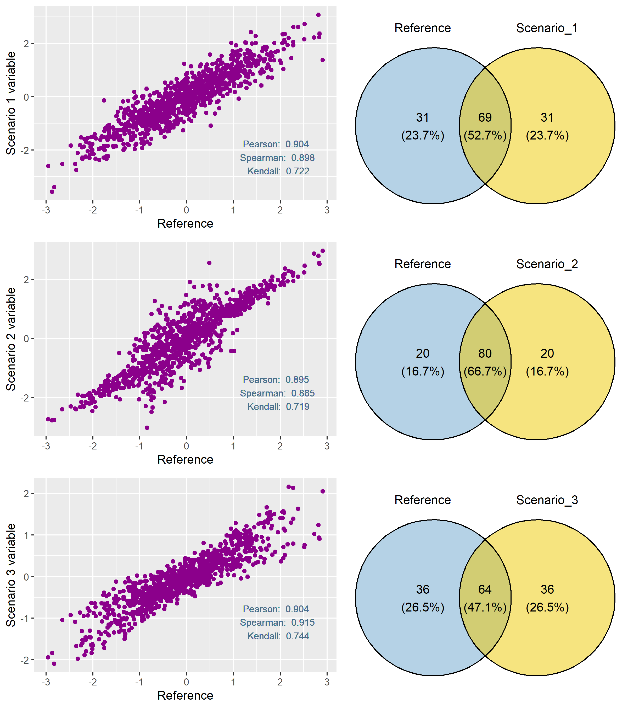
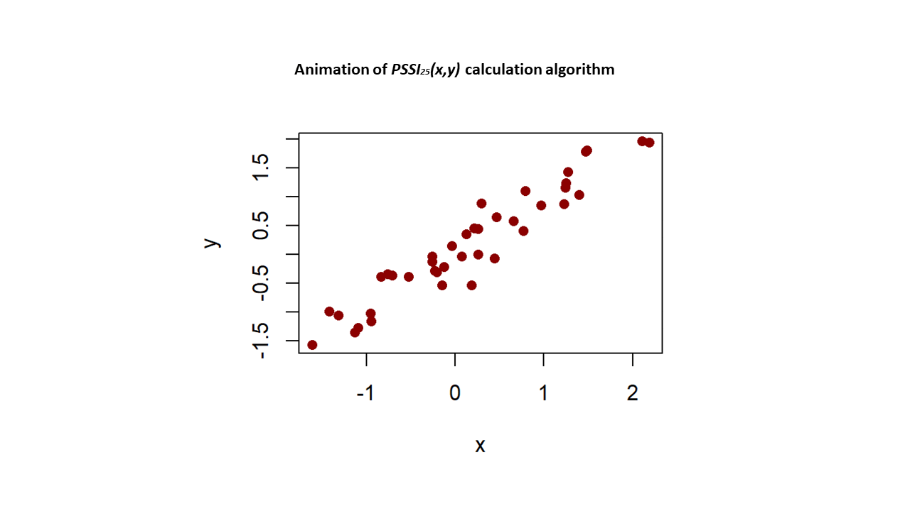
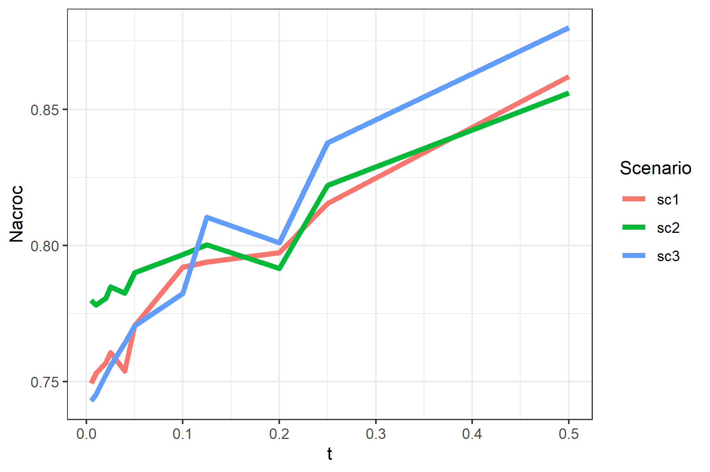

Thinking out loud 1: when tails (or even ouliers) matter
================
Fotis Pappas
2023-12-03

## The question

There are cases when meaningful insights on bivariate data can mostly be
drawn from the upper and/or lower tails. Covariance- and rank- based
**correlation** metrics might thus not be the best choice for such
cases. Of course there is the option of **tail-dependence** for
bivariate copulas, but from an applied data analysis perspective there
is room for metrics that assign different weights for set-similarities
in respective tiles (buckets) of the individual distributions.

So the question arises: how could such an **alternative metric** look
like?

## Example scenarios

In the figure below the same “base-scenario vector” is plotted against
vectors from 3 other scenarios, all of which present very similar
Pearson’s correlation coefficient to the “base”. Try to first only focus
on the left side and in particular the different correlation metrics
(covariance- and rank- based) in the bottom-right corner of each
scenario-plot. Can you rank the scenarios from best to worst? Which
metric would you trust the most under a selective breeding context
knowing that you are opting for selection of 100 elements (top 10%)?

On the right side of the figure there are venn diagrams visualizing the
intersection between the top 100 elements set of the base and the
respective top 100 sets of the three tested scenarios. Notice that the
“best” scenarios according to correlation coefficients are recovering
notably less top ranking elements compared to scenario 2 (80% of
base-set recovered).

Correlations and venn diagrams:

## Suggestion

A suggestion of how a metric could look like is briefly described below.

The Sorensen Dice Coefficient expresses similarity between sets A and B
as such:

$$SDC(A,B)=2\frac{|A \cap B|}{|A|+|B|}$$

For vectors X, Y and q-quantile $Q_t$ (\$ t \$) we define the left-side
quantile-defined set similarity as:

$$QSS_l(X_t,Y_t)=2\frac{|X_t \cap Y_t|}{|X_t|+|Y_t|}$$ where:
$`X_t={\{x∈X∣x \le Q_t\}}`, ` Y_t={\{y∈Y∣y \le Q_t\}}`$

Similarly, we define the right-side set similarity as:
$$QSS_r(X_t,Y_t)=2\frac{|X_{1-t} \cap Y_{1-t}|}{|X_{1-t}|+|Y_{1-t}|}$$
where:
$`X_{1-t}={\{x∈X∣x \ge Q_{1-t}\}}`, `Y_{1-t}={\{y∈Y∣y \ge Q_{1-t}\}}`$

Finally, we define a n-tile acro-correlation index (I apologize, my
imagination is not at its prime) for vectors X and Y with quantile step
t:

$$Nacroc_t(X,Y)= \left ({\sum_{i=t}^{0.5}{W_i}} \right )^{-1} \left ({\sum_{i = t}^{0.5}{\frac{W_i}{2}(QSS_l(X_i,Y_i) + QSS_r(X_{1-i},Y_{1-i}))}} \right )$$

Step t can be adjusted accordingly in each scenario. Ideally, t is a
positive proper divisor of 0.5.

Notice that a different weight is assigned for each step (symmetrical -
quadratic function of quantile
$W_t = \frac{1}{2} + (\frac{1}{2} - t)^2$).

## Algorithm demonstration for quartile step

## How does it work?

The figure below represents the same vector-pairs as in the initial one
but now the new metric(s) has been calculated.

## Properties - t sensitivity

Low t values are probably the way to go in this case. Choice of t step should be influenced by the proportion of informative/useful data in the upper and/or lower tails.
